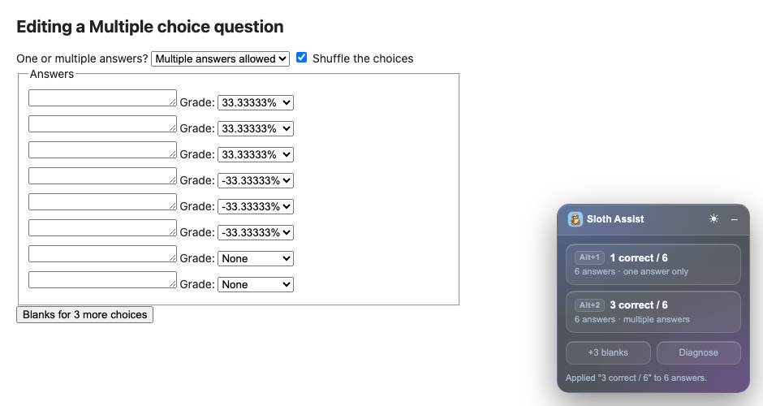
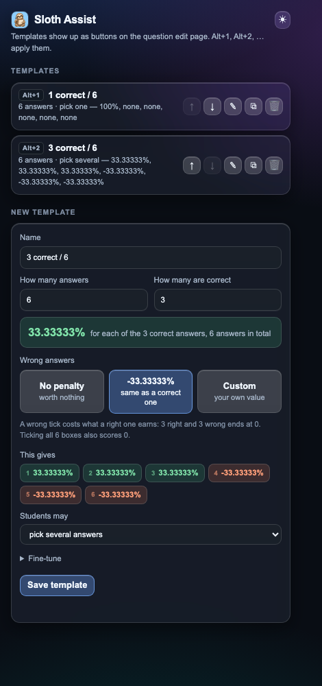
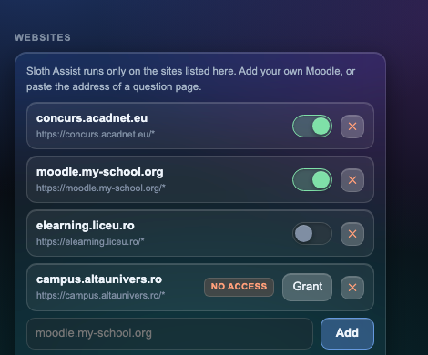

<div align="center">


# Sloth Assist

**Because clicking 6 grade dropdowns by hand is "work hard" instead of "work smart" and we don't do that here :))**

A Chrome extension for the Moodle question bank is the solution for the momment.
It adds the blank answers for you and fills every grade dropdown from a template,
in one click.



</div>

---

## What it does

Open a multiple-choice question for editing and a small glass panel appears in the
bottom-right corner with one button per template. Click one and it:

1. counts the answer slots on the page;
2. clicks Moodle's **"Blanks for 3 more choices"** as many times as needed - each
   click reloads the page, and the pending job resumes by itself afterwards;
3. sets every grade dropdown, puts any leftover slot back to *None*, and switches
   *One answer only / Multiple answers allowed* to match.

Your answer texts are never touched.

Two templates come ready to use:

| Template | Answers | Mode | Grades |
|---|---|---|---|
| **1 correct / 6** | 6 | one answer only | `100%`, then None |
| **3 correct / 6** | 6 | multiple answers | `33.33333%` ×3, `-33.33333%` ×3 |

Both are ordinary templates - rename, edit, reorder or delete them like any other.

---

## Install it in Chrome

No Web Store, no account, nothing to pay. Chrome loads it straight from a folder.

**1. Get the files**

```bash
git clone https://github.com/andreinita21/sloth-assist.git
```

Or on GitHub press **Code → Download ZIP**, then unzip it. Keep the folder
somewhere permanent - Chrome reads it from disk every time it starts, so
deleting or moving it removes the extension.

**2. Open the extensions page**

Type `chrome://extensions` in the address bar and press Enter.
(Or: ⋮ menu → **Extensions** → **Manage extensions**.)

**3. Turn on Developer mode**

Toggle it on, top right of that page. Three new buttons appear.

**4. Load unpacked**

Press **Load unpacked**, top left, and select the folder that contains
`manifest.json` - the folder itself, not a file inside it. The sloth appears in
your extension list.

**5. Pin it**

Click the puzzle-piece icon in the toolbar, then the pin next to *Sloth Assist*,
so the sloth stays visible. That icon opens the template manager.

**6. Use it**

Go to a question edit page on `concurs.acadnet.eu`, for example
`https://concurs.acadnet.eu/question/edit.php?cat=...` → edit a multiple-choice
question. The panel is waiting in the bottom-right corner.

> **After you change any file** (or update the repo): press the ↻ button on the
> Sloth Assist card in `chrome://extensions`, **and reload any question page you
> already had open**. A page opened before the update keeps running the old code.

---

## The template manager

<div align="center">

</div>

Click the sloth in the toolbar (or right-click it → **Options** for a full tab).

Every template in the list has:

| | |
|---|---|
| ↑ ↓ | move it - the order sets the panel buttons and the `Alt+1`, `Alt+2`, … shortcuts |
| ✎ | edit it in place |
| ⧉ | duplicate it as a starting point |
| 🗑 | delete it - asks a second time before it goes |

Deleted a built-in one by accident? A **Restore built-in templates** button shows
up under the list while any of them is missing.

### Building a template

Type how many answers there are and how many are correct. Everything below
recalculates as you type: what one correct answer is worth, the value on the
penalty button, and the answer-by-answer preview.

Then pick what a wrong answer is worth:

| Choice | Meaning |
|---|---|
| **No penalty** | a wrong tick is worth nothing - the normal choice when a single answer is correct |
| **-X% same as a correct one** | a wrong tick costs exactly what a right one earns |
| **Custom** | type any percentage you like |

For **8 answers of which 4 are correct**: each correct one is worth `25%`, *same
as a correct one* offers `-25%`, and **Custom** starts from the value that makes
ticking all 8 boxes score exactly 0. The line under the buttons always names that
value, whichever choice is selected.

*This gives* shows the final grade of every answer as a chip - green for points,
orange for a penalty, grey for None - before you save.

Under **Fine-tune** you can type the grades by hand: `100%, none*5` or
`33.33333%*3, -33.33333%*3`, where `none` is None and `*3` repeats a value. Any
percentage Moodle does not offer is snapped to the closest one that it does, and
the tip line says so.

---

## Which websites it runs on

Sloth Assist does nothing at all until a site is on its list. Open the manager
and look under **Websites**: `concurs.acadnet.eu` is there from the start, and
you can add any other Moodle you work on.

To add one, type its address - `moodle.my-school.org` - or simply paste the
address of a question page you have open; everything after the domain is
trimmed for you. Chrome then asks whether to grant access to that site, because
an extension may only touch sites you have approved. Accept, and the panel shows
up there from the next page load.

<div align="center">

</div>

Every site has its own switch:

| | Meaning |
|---|---|
| switch **on**, green | Sloth Assist is running there |
| switch **off**, grey | the site stays on the list but nothing runs there - flick it back any time |
| **no access** + **Grant** | Chrome's permission is missing, because you declined it or removed it later in Chrome's own settings; press **Grant** to ask again |

The ✕ button removes a site for good and hands its permission back to Chrome.

Two useful details:

* Removing `concurs.acadnet.eu` is allowed - if you do not use it, take it off
  the list and Sloth Assist will leave that site alone.
* A tab that is already open when you add a site keeps running without the
  panel. Reload it once.

## Panel extras

| | |
|---|---|
| `Alt+1` … `Alt+9` | apply the 1st … 9th template without touching the mouse |
| **+3 blanks** | click Moodle's add-blanks button once |
| **Diagnose** | print what the extension can see - dropdown count, the add button it matched, the available grade values - and copy it to the clipboard |
| ☀ / ☾ | switch between the dark and light tint; the panel and the manager follow each other |
| – | collapse the panel; it stays collapsed until you open it again |

Under **Options** in the manager, *on page load, expand every question to N
answers* grows every question page by itself, before you pick a template.

---

## Troubleshooting

**The panel is not there.** It only appears where the page has answer-grade
dropdowns, so make sure a multiple-choice question is actually open for editing.

**The panel looks old, or lists templates that are not in the manager.** That page
is running the code from before the last extension reload. Reload the tab
(`Cmd+R` / `Ctrl+R`) and it will match again - the panel says so itself when it
notices.

**The blanks button is not being found.** Different Moodle versions and languages
label it differently. Press **Diagnose**, and the report (already in your
clipboard) tells you what the page offers.

**The panel does not appear on a site I added.** Check its badge under
**Websites** in the manager. If it says *no access*, press **Grant**. If it says
*active*, reload the page - a tab opened before the site was added keeps running
without it.

---

## What is in the folder

| File | Purpose |
|---|---|
| `manifest.json` | extension definition: permissions, icons, the one site granted up front |
| `background.js` | registers the panel on whichever sites you have approved |
| `content.js` | the panel, reading the page, applying templates, the job that survives the reload |
| `templates.js` | the template model, grade parsing, the list of grades Moodle accepts |
| `manager.html` / `manager.js` | the popup and options page |
| `panel.css` | the glass panel styling |
| `icons/` | the sloth, at the sizes Chrome asks for |

Permissions: `storage`, to keep your templates and site list, and `scripting`,
to switch the panel on for the sites you approve. Access to any site other than
`concurs.acadnet.eu` is optional and asked for one site at a time, when you add
it. Nothing is sent anywhere - no account, no tracking, no network calls.
